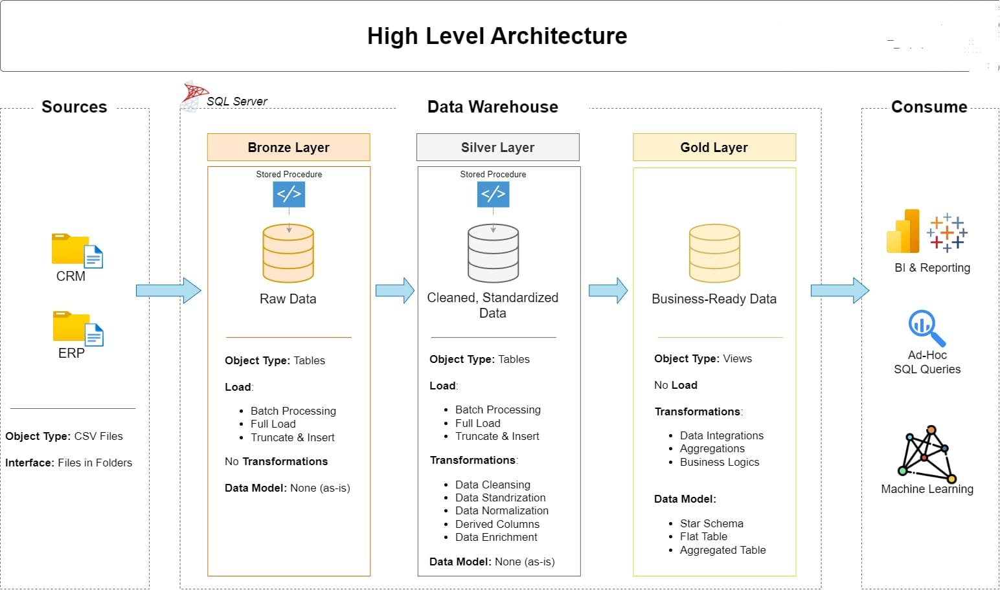
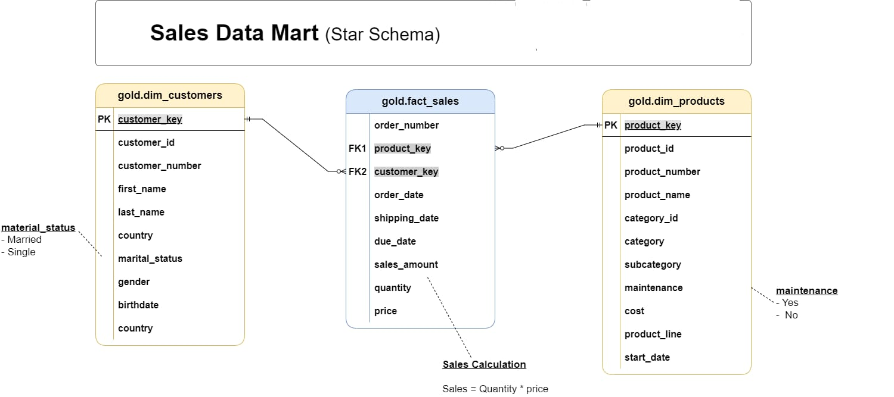

# 💎 SQL Data Warehouse & Analytics Project

<p align="center">
  
  
  
  
</p>

---

# 🌟 Executive Summary

This project demonstrates the design and implementation of a modern **SQL Data Warehouse** using **Medallion Architecture (Bronze, Silver, and Gold Layers)**.

The project includes end-to-end **ETL pipelines**, **data cleansing**, **dimensional data modeling**, and **SQL-based analytics** to transform raw ERP and CRM data into business-ready datasets for reporting and decision-making.

---

# 🛠️ Tech Stack

- Microsoft SQL Server
- SQL
- ETL Pipeline
- Medallion Architecture
- Star Schema
- SQL Server Management Studio (SSMS)
- CSV Data Sources

---

# 🏗️ Data Architecture

The project follows the **Medallion Architecture**, organizing data into Bronze, Silver, and Gold layers for scalable and maintainable data processing.

<p align="center">

</p>

### Architecture Workflow

```text
CSV Files
     │
     ▼
Bronze Layer
(Raw Data)
     │
     ▼
Silver Layer
(Data Cleaning & Transformation)
     │
     ▼
Gold Layer
(Business Ready Data)
     │
     ▼
Star Schema
     │
     ▼
SQL Analytics & Reporting
```

---

# 📂 Data Warehouse Layers

## 🥉 Bronze Layer

- Stores raw ERP and CRM datasets.
- Data is loaded directly from CSV files.
- No transformations are applied.

---

## 🥈 Silver Layer

- Cleans and validates raw data.
- Removes duplicates.
- Handles missing values.
- Standardizes formats.
- Prepares datasets for modeling.

---

## 🥇 Gold Layer

- Contains business-ready analytical datasets.
- Implements a Star Schema.
- Optimized for SQL reporting and analytics.

---

# ⭐ Star Schema Data Model

The Gold layer follows a **Star Schema** consisting of Fact and Dimension tables to support high-performance analytical queries.

<p align="center">

</p>

---

# 🔄 ETL Workflow

The ETL pipeline consists of the following stages:

1. Extract ERP and CRM datasets.
2. Load raw data into the Bronze layer.
3. Clean and transform data in the Silver layer.
4. Build analytical tables in the Gold layer.
5. Execute SQL queries for business reporting.

---

# 📈 Business Analytics

The data warehouse enables analysis of:

- Customer Behavior
- Product Performance
- Sales Trends
- Revenue Analysis
- Business Performance Reporting

---

# 💻 Sample SQL Analytics

### Top Customers by Sales

```sql
SELECT
    Customer_Name,
    SUM(Sales_Amount) AS TotalSales
FROM gold.fact_sales
GROUP BY Customer_Name
ORDER BY TotalSales DESC;
```

---

### Monthly Sales Trend

```sql
SELECT
    Year,
    Month,
    SUM(Sales_Amount) AS TotalSales
FROM gold.fact_sales
GROUP BY Year, Month
ORDER BY Year, Month;
```

---

# 📈 Key Business Insights

This warehouse supports business users in answering important analytical questions, including:

- Which customers generate the highest revenue?
- Which products contribute the most sales?
- How do monthly sales trends change over time?
- Which regions perform the best?
- Which products have declining demand?
- What are the key drivers of business performance?

---

# 🚀 Skills Demonstrated

- SQL Development
- Data Warehousing
- ETL Pipeline Design
- Data Cleansing
- Data Transformation
- Medallion Architecture
- Star Schema Modeling
- SQL Analytics
- Data Modeling
- Business Intelligence

---

# 📂 Repository Structure

```text
data-warehouse-project/
│
├── datasets/
│
├── docs/
│   ├── data_architecture.jpg
│   ├── data_models.jpg
│   ├── data_catalog.md
│   ├── etl.drawio
│   ├── data_flow.drawio
│   ├── naming-conventions.md
│
├── scripts/
│   ├── bronze/
│   ├── silver/
│   ├── gold/
│
├── tests/
│
├── README.md
├── LICENSE
├── .gitignore
└── requirements.txt
```

---

# 🚀 Future Enhancements

- Incremental Data Loading
- Automated ETL Scheduling
- SQL Performance Optimization
- Power BI Dashboard Integration
- Cloud Data Warehouse Deployment
- Data Quality Monitoring

---

# 👩‍💻 About Me

**Gargi Kundu**

Aspiring **Data Analyst** with hands-on experience in **SQL, Power BI, Python, PostgreSQL, and Data Warehousing**. Passionate about building scalable data solutions and transforming raw data into actionable business insights.

📧 **Email:** gargikundu211@gmail.com

💼 **LinkedIn:** https://www.linkedin.com/in/gargi-kundu

🐙 **GitHub:** https://github.com/Gargik283

---

# ⭐ Support

If you found this project helpful, consider giving it a ⭐ on GitHub.

Thank you for visiting my repository!
